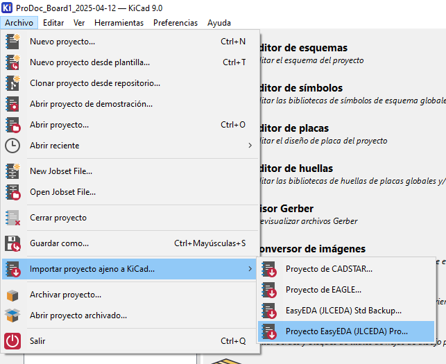

# RP2350-Board

Placa de desarrollo educativa basada en el microcontrolador **RP2350B** con sensores integrados, conectividad WiFi y amplia gama de periféricos para aprendizaje y prototipado.

## 🚀 Características Principales

- **Doble microcontrolador**: RP2350B principal + RP2040-Zero para debug
- **Sensores integrados**: DHT11, DS18B20, BMP180, BH1750, CNY70
- **Conectividad WiFi**: Módulo ESP-01 integrado
- **Display OLED**: Pantalla 0.91" 128x32 I2C
- **Periféricos**: LEDs, buzzer, pulsadores, potenciómetros
- **Expansión**: Headers para GPIO, ADC e I2C

---

## 🔧 Hardware Overview

### Microcontroladores

- **RP2350B (U1)**: MCU principal con USB nativo y acceso completo a periféricos
- **RP2040-Zero (U2)**: Utilizado exclusivamente para debug y comunicación auxiliar

### Alimentación

- **USB-C Principal**: Conectado directamente al RP2350B
- **Regulación**: 5V USB → AMS1117 → 3.3V para toda la placa
- **Distribución**: Fuentes 3.3V, 1.1V (interno) y 5V disponibles

### Sensores y Periféricos Integrados

| Componente     | Interfaz       | Función                           |
| -------------- | -------------- | --------------------------------- |
| **DHT11**      | Digital (GP3)  | Temperatura y humedad             |
| **DS18B20**    | 1-Wire (GP2)   | Temperatura alta precisión        |
| **BMP180**     | I2C            | Presión atmosférica y temperatura |
| **BH1750**     | I2C            | Sensor de luz ambiente            |
| **CNY70**      | Digital (GP19) | Sensor óptico reflexivo           |
| **ESP-01**     | UART (GP6/GP7) | Conectividad WiFi                 |
| **OLED 0.91"** | I2C            | Display 128x32                    |

---

## 📋 Tabla de Conexiones

### 🔌 RP2350B - Pines GPIO

| Pin GPIO    | Función     | Conectado a          | Descripción               |
| ----------- | ----------- | -------------------- | ------------------------- |
| **GP2**     | Digital I/O | DS18B20, R19         | Sensor temperatura 1-Wire |
| **GP3**     | Digital I/O | DHT11, R20           | Sensor temp/humedad       |
| **GP4**     | I2C SDA     | OLED, BMP180, BH1750 | Bus I2C sensores          |
| **GP5**     | I2C SCL     | OLED, BMP180, BH1750 | Bus I2C sensores          |
| **GP6**     | UART TX     | ESP-01               | WiFi - Transmisión        |
| **GP7**     | UART RX     | ESP-01               | WiFi - Recepción          |
| **GP10**    | Digital Out | LED D1 (Rojo)        | Indicador LED             |
| **GP11**    | Digital Out | LED D2 (Verde)       | Indicador LED             |
| **GP12**    | Digital Out | LED D3 (Azul)        | Indicador LED             |
| **GP13-15** | Digital Out | LED RGB D4           | LED RGB (R/G/B)           |
| **GP16**    | Digital Out | Buzzer (via Q1)      | Salida sonora             |
| **GP17**    | Digital In  | Pulsador SW2         | Entrada con pullup        |
| **GP18**    | Digital In  | Pulsador SW1         | Entrada con pullup        |
| **GP19**    | Digital In  | Sensor CNY70         | Sensor óptico             |
| **GP20-39** | Digital I/O | Headers H1           | Expansión GPIO            |

### 🔍 Pines Especiales y Debug

| Pin              | Función | Conectado a | Descripción             |
| ---------------- | ------- | ----------- | ----------------------- |
| **SWCLK/SWDIO**  | Debug   | RP2040-Zero | Comunicación debug      |
| **I2C0 SDA/SCL** | I2C     | RP2040-Zero | Comunicación entre MCUs |
| **RUN**          | Reset   | Botón RUN   | Pin de reset            |
| **UART TX/RX**   | UART    | Header H3   | UART debug externo      |

### 📊 Pines Analógicos (ADC)

| Pin ADC    | Conectado a             | Función           |
| ---------- | ----------------------- | ----------------- |
| **ADC0**   | Potenciómetro PR1, H2.8 | Entrada analógica |
| **ADC1**   | Potenciómetro PR2, H2.7 | Entrada analógica |
| **ADC2-7** | Headers H2.6-H2.1       | Expansión ADC     |

### 🛠 RP2040-Zero - Pines Disponibles

| Pin GPIO   | Conectado a    | Función            |
| ---------- | -------------- | ------------------ |
| **GP0-1**  | Headers H6.1-2 | GPIO expansión     |
| **GP6-8**  | Headers H6.3-5 | GPIO expansión     |
| **GP9-15** | Headers H5/H4  | GPIO/ADC expansión |

---

## 🛠 Herramientas de Desarrollo

### Diseño de Hardware

- **Software**: EasyEDA
- **Importar a KiCad**:
  ```
  Archivo > Importar proyecto ajeno > EasyEDA (JLCEDA Pro)
  ```
- **⚠️ Importante**: Usar KiCad 9+ para evitar bugs de importación

### Esquemático y PCB

<p align="center">
  
</p>

---

## 📚 Referencias y Documentación

- 📖 **Basado en**: [Hardware Design with RP2350](https://datasheets.raspberrypi.com/rp2350/hardware-design-with-rp2350.pdf)
- 🔗 **Datasheet RP2350**: [Raspberry Pi Documentation](https://datasheets.raspberrypi.com/rp2350/rp2350-datasheet.pdf)
- 📋 **SDK Examples**: [pico-examples](https://github.com/raspberrypi/pico-examples)

---

## 🧑‍💻 Autor y Contacto

**Proyecto desarrollado por**: [@monti3](https://github.com/monti3)

📧 **Para consultas técnicas o archivos originales**: Abrir issue en este repositorio

---

> 💡 **Nota**: Este es un proyecto educativo diseñado para facilitar el aprendizaje de programación en microcontroladores RP2350.
>
> ⚡ **Estado**: Hardware validado - Software en desarrollo

---

_Última actualización: Junio 2025_
